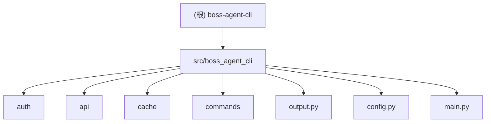

# boss-agent-cli

# Agent Team PUA 配置
所有 teammate 开工前必须加载 pua skill。
teammate 失败 2 次以上时向 Leader 发送 [PUA-REPORT] 格式汇报。
Leader 负责全局压力等级管理和跨 teammate 失败传递。

## 项目愿景

专为 AI Agent 设计的 BOSS 直聘求职 CLI 工具。结合 geekgeekrun（浏览器自动化 + 反检测）和 boss-cli（CLI + 结构化输出）的优势，让 AI Agent 通过 subprocess 调用 CLI、读取 stdout JSON 输出，完成完整的求职操作链。

## 架构总览

```
CLI 入口 (Click)
    |
    +---> AuthManager (Token 生命周期)
    |         |
    |         +---> TokenStore (Fernet 加密持久化)
    |         +---> Playwright (Headless 登录 / stoken 刷新)
    |
    +---> BossClient (httpx)
    |         |
    |         +---> BOSS 直聘 wapi 接口
    |
    +---> CacheStore (SQLite WAL)
    |
    +---> output.py (JSON 信封) ---> stdout
```

**数据流**：CLI 命令 -> AuthManager 确保有效 Token -> BossClient 发起 API 请求 -> output.py 格式化为 JSON 信封 -> stdout

**输出约定**：
- stdout: 仅 JSON 结构化数据
- stderr: 日志和进度信息（通过 `--log-level` 控制）
- exit code 0: 命令成功 (ok=true)
- exit code 1: 命令失败 (ok=false)

## 模块结构图



## 模块索引

| 模块路径 | 语言 | 职责 | 入口文件 | 测试 |
|----------|------|------|----------|------|
| `src/boss_agent_cli/` | Python | 包根目录，版本号 | `__init__.py` | - |
| `src/boss_agent_cli/auth/` | Python | Token 生命周期：加密存储、浏览器登录、stoken 刷新、文件锁 | `manager.py` | `tests/test_auth.py` |
| `src/boss_agent_cli/api/` | Python | wapi 端点常量、数据模型 (dataclass)、httpx 统一请求入口 | `client.py` | `tests/test_api.py` |
| `src/boss_agent_cli/cache/` | Python | SQLite WAL 缓存（搜索历史 100 条上限、已打招呼记录） | `store.py` | `tests/test_cache.py` |
| `src/boss_agent_cli/commands/` | Python | Click CLI 命令：schema/login/status/search/detail/greet/batch-greet | `search.py`, `greet.py` | `tests/test_commands.py` |
| `src/boss_agent_cli/output.py` | Python | JSON 信封封装 + Logger（stderr 日志级别过滤） | - | `tests/test_output.py` |
| `src/boss_agent_cli/config.py` | Python | 配置文件读取与默认值 (`~/.boss-agent/config.json`) | - | `tests/test_output.py` |
| `src/boss_agent_cli/main.py` | Python | Click CLI group 入口 + 全局选项 + 配置加载 | - | `tests/test_commands.py` |

## 技术栈

| 类别 | 选型 | 版本要求 |
|------|------|----------|
| 语言 | Python | >=3.10 |
| CLI 框架 | Click | >=8.0 |
| HTTP 客户端 | httpx | >=0.27 |
| 浏览器自动化 | Playwright + playwright-stealth | >=1.40 / >=1.0 |
| 加密 | cryptography (Fernet + PBKDF2) | >=42.0 |
| 数据库 | sqlite3（标准库，WAL 模式） | - |
| 包管理/构建 | uv + hatchling | - |
| 测试 | pytest | >=7.0 |

## 运行与开发

```bash
# 初始化项目
cd /Users/can4hou6joeng4/Documents/code/boss-agent-cli
uv sync --all-extras
uv run playwright install chromium

# 验证安装
uv run python -c "import boss_agent_cli; print(boss_agent_cli.__version__)"

# 运行 CLI
uv run boss schema             # 查看工具能力描述
uv run boss --help             # 查看帮助
uv run boss search --help      # 查看 search 命令帮助

# 运行测试
uv run pytest tests/ -v
```

**CLI 入口点**：`boss = boss_agent_cli.main:cli`（定义在 `pyproject.toml` 的 `[project.scripts]`）

**本地存储目录**：`~/.boss-agent/`
```
~/.boss-agent/
  auth/
    session.enc      # Fernet 加密的 Cookie/Token/stoken
    salt             # PBKDF2 salt（16 字节随机值）
    refresh.lock     # 文件锁（刷新时临时创建）
  cache/
    boss_agent.db    # SQLite WAL 模式
  config.json        # 用户配置
```

## 测试策略

- **测试框架**：pytest
- **测试目录**：`tests/`
- **TDD 流程**：先写测试 (RED) -> 运行失败 -> 实现代码 (GREEN) -> 重构
- **Mock 策略**：命令层测试通过 `unittest.mock.patch` 替换 AuthManager、BossClient、CacheStore
- **测试文件映射**：
  - `tests/test_output.py` -> output.py + config.py
  - `tests/test_cache.py` -> cache/store.py
  - `tests/test_auth.py` -> auth/token_store.py
  - `tests/test_api.py` -> api/endpoints.py + api/models.py
  - `tests/test_commands.py` -> commands/* + main.py

## 编码规范

- **缩进**：使用 tab，不使用空格
- **语言要求**：Python >=3.10（使用 `X | Y` 联合类型语法）
- **输出协议**：所有命令必须通过 `emit_success` / `emit_error` 输出 JSON 信封到 stdout
- **错误处理**：模块层抛异常（如 `AuthRequired`、`TokenRefreshFailed`），命令层统一捕获并转为 JSON 错误信封
- **不可变数据**：优先使用 `dataclass` 和纯函数
- **包管理器**：pnpm（前端相关）/ uv（Python）

## 错误码枚举

| 错误码 | 说明 | 可恢复 | 恢复动作 |
|--------|------|--------|----------|
| AUTH_EXPIRED | 登录态过期 | 是 | `boss login` |
| AUTH_REQUIRED | 未登录 | 是 | `boss login` |
| RATE_LIMITED | 请求频率过高 | 是 | 等待后重试 |
| TOKEN_REFRESH_FAILED | Token 刷新失败 | 是 | `boss login` |
| JOB_NOT_FOUND | 职位不存在或已下架 | 否 | - |
| ALREADY_GREETED | 已向该招聘者打过招呼 | 否 | - |
| GREET_LIMIT | 今日打招呼次数已用完 | 否 | - |
| NETWORK_ERROR | 网络请求失败 | 是 | 重试 |
| INVALID_PARAM | 参数校验失败 | 否 | 修正参数 |

## AI 使用指引

**Agent 典型调用链**：
```
boss schema   -> 理解工具能力
boss status   -> 检查登录态
boss login    -> 若未登录，提示用户扫码
boss search   -> 搜索职位（返回含 security_id 的列表）
boss detail   -> 查看详情（可选，返回也含 security_id）
boss greet    -> 打招呼（security_id 可从 search 或 detail 获取）
```

**关键设计决策**：
- `boss detail` 不是 `boss greet` 的必要前置步骤。Agent 可从 `boss search` 结果直接获取 `security_id` 进行打招呼
- 信封格式中的 `hints.next_actions` 字段为 Agent 提供下一步行动建议
- `boss schema` 返回完整工具自描述，Agent 调用一次即可理解所有命令

**相关文档**：
- 设计规范：`docs/superpowers/specs/2026-03-20-boss-agent-cli-design.md`
- 实施计划：`docs/superpowers/plans/2026-03-20-boss-agent-cli.md`

## Git 规范

- commit message 格式：`type: 中文描述`
- type 类型：feat / fix / refactor / perf / docs / test / chore / ci

## 变更记录 (Changelog)

| 日期 | 操作 | 说明 |
|------|------|------|
| 2026-03-20 | 初始创建 | 基于设计规范和实施计划生成，项目处于预实现阶段（仅有设计文档，尚无源代码） |
