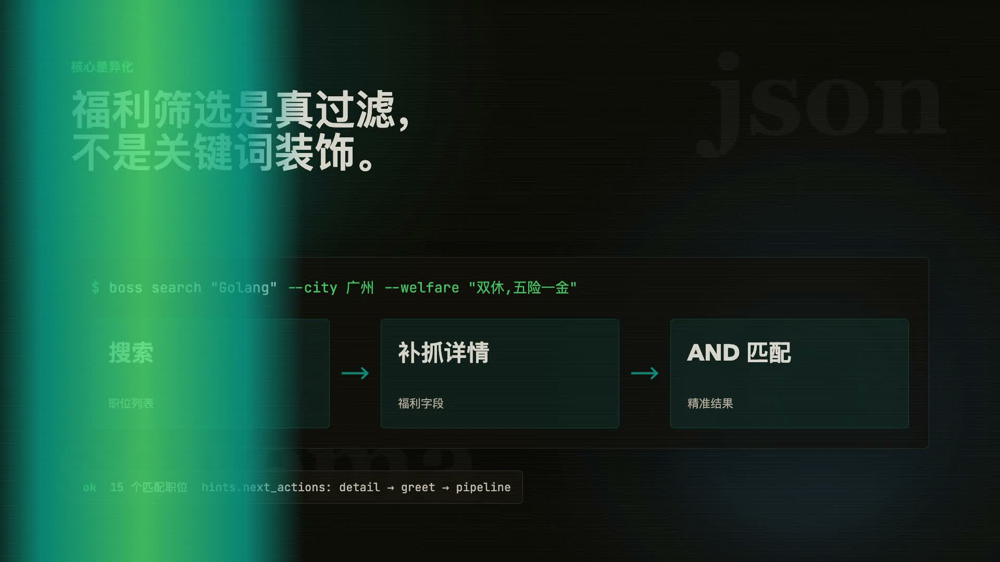

<div align="center">

# boss-agent-cli

**专为 AI Agent 设计的 BOSS 直聘双端 CLI 工具**

> 求职者：搜索 · 福利筛选 · 个性化推荐 · 自动打招呼 · 求职流水线 · 增量监控 · AI 简历优化
>
> 招聘者：候选人检索 · 沟通回复 · 简历请求 · 职位上下线 · 多平台抽象

[](https://github.com/can4hou6joeng4/boss-agent-cli/actions/workflows/ci.yml)
[](https://codecov.io/gh/can4hou6joeng4/boss-agent-cli)
[](https://python.org)
[](LICENSE)
[](https://github.com/can4hou6joeng4/boss-agent-cli/releases)
[](https://pypi.org/project/boss-agent-cli/)
[](https://github.com/can4hou6joeng4/boss-agent-cli/graphs/contributors)
[](https://github.com/can4hou6joeng4/boss-agent-cli/pulls)
[](https://codespaces.new/can4hou6joeng4/boss-agent-cli)

[快速上手](docs/getting-started.md) · [安装](#-安装) · [快速开始](#-快速开始) · [角色模式](#-角色模式与多平台) · [Agent 集成](#-ai-agent-集成) · [命令参考](#-命令参考) · [排障](#-诊断与排障) · [架构](#-技术架构) · [更新日志](CHANGELOG.md) · [路线图](ROADMAP.md)

**中文** | [English](README.en.md)

<a href="demo/showcase/boss-agent-cli-showcase.mp4">
  
</a>

**[观看 16 秒项目展示视频](demo/showcase/boss-agent-cli-showcase.mp4)** · schema 驱动 · 福利筛选 · JSON 信封 · 开源工程质量


</div>

> A CLI tool designed for AI Agents to interact with [BOSS Zhipin](https://www.zhipin.com/) (China's largest recruitment platform). Structured JSON output, schema-driven capability discovery, 4-tier login fallback, recruiter workflow support, and a cross-platform adapter layer. See [README.en.md](README.en.md) for the English version.

---

## 💡 为什么用 boss-agent-cli？

传统求职：打开网页 → 翻几十页 → 逐个看详情 → 手动打招呼 → 忘了跟进谁。

**boss-agent-cli 让 AI Agent 替你完成全部操作**：

```bash
boss search "Golang" --city 广州 --welfare "双休,五险一金"   # 搜索 + 福利筛选
boss detail <security_id>                                    # 查看详情
boss greet <security_id> <job_id>                            # 一键打招呼
boss pipeline                                                # 流水线追踪
boss digest                                                  # 每日汇报
```

所有输出为 **结构化 JSON**，Agent 一调用就能理解，一调用就能行动。

---

## 🧭 导航目录

- [为什么用 boss-agent-cli](#-为什么用-boss-agent-cli)
- [核心能力](#-核心能力)
- [安装](#-安装)
- [快速开始](#-快速开始)
- [登录链路](#-登录链路)
- [角色模式与多平台](#-角色模式与多平台)
- [AI Agent 集成](#-ai-agent-集成)
- [命令参考](#-命令参考)
- [诊断与排障](#-诊断与排障)
- [配置](#-配置)
- [技术架构](#-技术架构)
- [贡献](#-贡献)

---

## 🌟 核心能力

### 求职者工作流

- `🔍 职位发现`：关键词搜索、8 维筛选、个性化推荐、按编号回看同一条结果。命令：`search` `recommend` `show`
- `🎯 福利筛选`：`--welfare "双休,五险一金"` 会自动翻页、补抓详情、按 AND 逻辑做真实匹配。命令：`search --welfare`
- `👋 主动出击`：从职位详情直接打招呼、批量打招呼、立即沟通投递。命令：`detail` `greet` `batch-greet` `apply`
- `📊 流程推进`：流水线、跟进提醒、每日摘要、投递转化漏斗一条线闭环。命令：`pipeline` `follow-up` `digest` `stats`
- `👀 增量监控`：保存搜索条件、定期执行、标出新职位、沉淀 shortlist。命令：`watch` `preset` `shortlist`
- `💬 沟通管理`：聊天列表、消息历史、结构化摘要、标签和联系方式交换。命令：`chat` `chatmsg` `chat-summary` `mark` `exchange`
- `🤖 AI 求职增强`：JD 分析、简历润色、定向优化、模拟面试、沟通指导。命令：`ai analyze-jd` `ai polish` `ai optimize` `ai interview-prep` `ai chat-coach`

### 招聘者工作流

- `👔 候选人运营`：投递申请、候选人搜索、沟通列表、在线简历查看与附件简历请求。命令：`hr applications` `hr candidates` `hr chat` `hr resume` `hr request-resume`
- `💬 招聘沟通`：直接回复候选人消息，把 HR 场景纳入同一套 JSON 协议。命令：`hr reply`
- `📌 职位管理`：查看职位、上架、下架，作为招聘者端的最小可操作闭环。命令：`hr jobs list` `hr jobs online` `hr jobs offline`

### 平台与集成基础

- `🔌 多平台抽象`：`Platform` / `RecruiterPlatform` 双注册表已落地；BOSS 直聘求职者/招聘者均可用，智联招聘已接通求职者侧登录、只读与写操作链路。命令：`--platform zhipin|zhilian`
- `📤 结构化输出`：stdout 只输出 JSON 信封，适合 CLI 编排、Shell Agent、MCP 和 Python SDK。命令：`schema` `export`
- `🧩 Agent 接入`：同一套能力可通过 Skill、subprocess、MCP、Python SDK 四种路径暴露给 Agent。文档：`docs/agent-quickstart.md` `docs/agent-hosts.md`

---

## 📦 安装

```bash
# 推荐：通过 uv 安装（秒级，自动隔离）
uv tool install boss-agent-cli

# 安装浏览器（用于登录）
patchright install chromium
```

<details>
<summary>📋 其他安装方式</summary>

```bash
# pipx（隔离环境）
pipx install boss-agent-cli
patchright install chromium

# pip
pip install boss-agent-cli
patchright install chromium

# 从源码（开发用）
git clone https://github.com/can4hou6joeng4/boss-agent-cli.git
cd boss-agent-cli
uv sync --all-extras
uv run patchright install chromium
```

</details>

---

## 🚀 快速开始

```bash
# 1. 环境自检
boss doctor

# 2. 登录（按平台选择链路）
boss login

# 3. 验证登录态
boss status

# 4. 搜索广州的 Golang 职位，要求双休+五险一金
boss search "Golang" --city 广州 --welfare "双休,五险一金"

# 5. 查看详情 → 打招呼 → 投递
boss detail <security_id>
boss greet <security_id> <job_id>
boss apply <security_id> <job_id>

# 6. 推荐 + 导出
boss recommend
boss export "Golang" --city 广州 --count 50 -o jobs.csv

# 7. 流水线 + 每日摘要
boss pipeline
boss digest

# 8. 增量监控
boss watch add my-golang "Golang" --city 广州 --welfare "双休"
boss watch run my-golang

# 9. 招聘者模式（HR 视角）
boss hr applications                  # 候选人投递申请
boss hr candidates "Golang"           # 搜索候选人
boss hr reply <friend_id> "你好"      # 回复消息
boss hr jobs list                     # 我发布的职位
```

---

## 🔐 登录链路

`boss login` 会按当前平台选择登录链路：

| 平台 | 登录链路 | 说明 |
|------|----------|------|
| `zhipin` | **Cookie 提取 → CDP → QR httpx → patchright** | 保留现有四级降级链路 |
| `zhilian` | **Cookie 提取 → CDP → 浏览器登录** | 当前优先复用本地浏览器登录态；无 QR httpx 分支 |

补充说明：
- `boss login` 默认按当前 `--platform` / 配置文件里的 `platform` 工作
- `boss --platform zhilian login` 已可用，当前覆盖**求职者侧**认证链路
- `boss --platform zhilian` 目前已支持候选者侧 `search / detail / recommend / user_info / greet / apply`
- `boss --platform zhilian hr ...` 仍不支持，CLI 会直接拒绝执行招聘者侧子命令

涉及 Cookie、CDP、patchright、真实账号、请求频率或平台接口漂移的问题，请先阅读 [平台风险边界](docs/platform-risk.md)。

<details>
<summary>📖 CDP 启动示例</summary>

```bash
# macOS
/Applications/Google\ Chrome.app/Contents/MacOS/Google\ Chrome \
  --remote-debugging-port=9222 --user-data-dir=/tmp/boss-chrome

# Linux
google-chrome --remote-debugging-port=9222 --user-data-dir=/tmp/boss-chrome

# 使用 CDP 登录
boss --cdp-url http://localhost:9222 login --cdp
```

</details>

---

## 🎭 角色模式与多平台

boss-agent-cli 同时覆盖求职者和招聘者两端，并为后续接入更多招聘平台做了抽象。

### 角色切换

| 选项 | 说明 | 典型命令 |
|------|------|----------|
| `--role candidate`（默认） | 求职者视角 | `search` / `greet` / `apply` |
| `--role recruiter` | 招聘者视角 | `hr applications` / `hr candidates` |

快捷入口：`boss hr <子命令>` 会自动把当前会话切换到招聘者角色，不必显式传 `--role`。

```bash
# 方式 A: --role 显式指定
boss --role recruiter ...

# 方式 B: 招聘者快捷组（自动切换 role）
boss hr applications
boss hr candidates "Golang"
```

注意：
- `boss hr ...` 当前仅支持默认招聘者平台 `zhipin-recruiter`
- 若当前平台是 `zhilian`，CLI 会在入口直接提示切回 `boss --platform zhipin hr ...`

### 多平台抽象

`Platform` / `RecruiterPlatform` 双注册表让命令层不耦合具体平台协议：

| 平台 | 求职者 | 招聘者 | 状态 |
|------|:------:|:------:|------|
| BOSS 直聘 (`zhipin`) | ✅ | ✅ | 默认 |
| 智联招聘 (`zhilian`) | 🟡 候选者侧登录 + 读写链路已接通 | — | 招聘者侧未接入，运行时会直接拒绝 `hr` 子命令 |

```bash
# 指定平台
boss --platform zhilian search "Python"

# 设为默认
boss config set platform zhilian
```

设计细节见 [docs/platform-abstraction.md](docs/platform-abstraction.md)。

---

## 🤖 AI Agent 集成

推荐先阅读：[Agent Quickstart](docs/agent-quickstart.md) · [Host Examples](docs/agent-hosts.md) · [Capability Matrix](docs/capability-matrix.md)

### 方式一：Skill 安装（推荐）

```bash
npx skills add can4hou6joeng4/boss-agent-cli
```

安装后 Agent 自动获得调用 `boss` 命令的能力，无需手动配置。

### 方式二：手动配置

在 AI Agent 的规则文件中添加：

```markdown
当用户要求搜索职位、投递、打招呼等 BOSS 直聘操作时，通过 Bash 调用 `boss` CLI：
1. 运行 `boss status` 检查登录态
2. 若未登录，运行 `boss login` 提示用户扫码
3. 根据用户意图调用 search / recommend / detail / greet
4. 解析 stdout JSON，`ok` 字段判断成败
5. 用户提到福利要求时使用 `--welfare` 参数
```

### 方式三：Python 直接嵌入（不走 subprocess）

包已随 `py.typed` 标记发布，可直接作为类型化的 Python 库使用：

```python
from boss_agent_cli import AuthManager, BossClient, AuthRequired

auth = AuthManager(data_dir=Path("~/.boss-agent").expanduser())
try:
    with BossClient(auth) as client:
        result = client.search_jobs("Golang", city="广州")
except AuthRequired:
    ...  # 提示用户 boss login
```

公开 API（详见 `boss_agent_cli.__all__`）：`AuthManager` / `BossClient` / `CacheStore` / `JobItem` / `JobDetail` / `AIService` / `ResumeData` 等核心类型。

### 输出协议

所有命令输出 JSON 到 stdout，统一信封格式：

```json
{
  "ok": true,
  "schema_version": "1.0",
  "command": "search",
  "data": [...],
  "pagination": {"page": 1, "has_more": true, "total": 15},
  "error": null,
  "hints": {"next_actions": ["boss detail <security_id>"]}
}
```

| 约定 | 说明 |
|------|------|
| `stdout` | 仅 JSON 结构化数据 |
| `stderr` | 日志和进度信息 |
| `exit 0` | 命令成功 (`ok=true`) |
| `exit 1` | 命令失败 (`ok=false`) |

---

## 📚 命令参考

### 基础操作

| 命令 | 说明 |
|------|------|
| `boss schema` | 输出完整工具能力描述 JSON（34 个顶层命令 + hr 分组展开，Agent 首先调用） |
| `boss login` | 四级降级登录 |
| `boss logout` | 退出登录 |
| `boss status` | 检查登录态 |
| `boss doctor` | 诊断环境、依赖、凭据完整性和网络 |
| `boss me` | 我的信息（用户/简历/期望/投递记录） |

### 职位搜索

| 命令 | 说明 |
|------|------|
| `boss search <query>` | 搜索职位（支持 `--welfare` 筛选、`--preset` 预设） |
| `boss recommend` | 个性化推荐 |
| `boss detail <security_id>` | 职位详情（`--job-id` 走快速通道） |
| `boss show <#>` | 按编号查看上次搜索结果 |
| `boss cities` | 40 个支持城市 |

### 求职动作

| 命令 | 说明 |
|------|------|
| `boss greet <sid> <jid>` | 打招呼 |
| `boss batch-greet <query>` | 批量打招呼（上限 10） |
| `boss apply <sid> <jid>` | 投递/立即沟通（幂等） |
| `boss exchange <sid>` | 交换手机/微信 |

### 沟通跟进

| 命令 | 说明 |
|------|------|
| `boss chat` | 沟通列表（导出 html/md/csv/json） |
| `boss chatmsg <sid>` | 聊天消息历史 |
| `boss chat-summary <sid>` | 结构化摘要 |
| `boss mark <sid> --label X` | 标签管理（9 种） |
| `boss interviews` | 面试邀请 |
| `boss history` | 浏览历史 |

### 流水线监控

| 命令 | 说明 |
|------|------|
| `boss pipeline` | 求职流水线（各阶段状态） |
| `boss follow-up` | 跟进提醒（超时未推进） |
| `boss digest` | 每日摘要 |
| `boss watch add/list/remove/run` | 增量监控 |
| `boss shortlist add/list/remove` | 候选池 |
| `boss preset add/list/remove` | 搜索预设 |

### 招聘者模式

| 命令 | 说明 |
|------|------|
| `boss hr applications` | 查看候选人投递申请列表 |
| `boss hr resume` | 查看或请求候选人简历 |
| `boss hr chat` | 查看与候选人的沟通列表 |
| `boss hr jobs list/offline/online` | 职位列表与上下线管理 |
| `boss hr candidates <keyword>` | 搜索候选人 |
| `boss hr reply <friend_id> <message>` | 回复候选人消息 |
| `boss hr request-resume <friend_id> --job-id <id>` | 请求候选人分享附件简历 |

### 简历与 AI

| 命令 | 说明 |
|------|------|
| `boss resume init/list/show/edit/delete/export/import/clone/diff/link/applications` | 本地简历管理 |
| `boss ai config` | 配置 AI 服务 |
| `boss ai analyze-jd` | 分析岗位要求 |
| `boss ai polish` | 润色简历 |
| `boss ai optimize` | 针对目标岗位优化 |
| `boss ai suggest` | 求职建议 |
| `boss ai reply` | 生成招聘者消息回复草稿 |
| `boss ai interview-prep` | 基于 JD 生成模拟面试题 |
| `boss ai chat-coach` | 基于聊天记录给沟通建议 |

> 支持 Claude 4.7 / GPT-5 / DeepSeek-V3 / Qwen3 等最新模型，详见 [推荐模型与入口](docs/integrations/ai-models.md)。

### 系统管理

| 命令 | 说明 |
|------|------|
| `boss config list/set/reset` | 配置管理 |
| `boss clean` | 清理缓存 |
| `boss stats` | 投递转化漏斗统计（greeted/applied/shortlist） |
| `boss export <query>` | 导出结果（CSV/JSON） |

<details>
<summary>🔎 搜索筛选参数详解</summary>

```bash
boss search "golang" \
  --city 广州 \             # 城市（40 个可选）
  --salary 20-50K \         # 薪资范围
  --experience 3-5年 \      # 经验要求
  --education 本科 \        # 学历要求
  --scale 100-499人 \       # 公司规模
  --industry 互联网 \       # 行业
  --stage 已上市 \          # 融资阶段
  --welfare "双休,五险一金"  # 福利筛选（AND 逻辑）
```

**福利筛选工作原理**：
1. 先检查职位福利标签（`welfareList`）
2. 标签不匹配时自动获取职位描述全文搜索
3. 自动翻页（最多 5 页）
4. 每个结果带 `welfare_match` 说明匹配来源

支持关键词：`双休` `五险一金` `年终奖` `餐补` `住房补贴` `定期体检` `股票期权` `加班补助` `带薪年假`

</details>

---

## 🔧 诊断与排障

```bash
boss doctor
```

| 检查项 | 说明 |
|--------|------|
| `python` | Python 版本 >= 3.10 |
| `patchright` | CLI 已安装 |
| `patchright_chromium` | Chromium 已安装 |
| `cookie_extract` | 本地浏览器 Cookie 可提取 |
| `auth_session` | 登录态存在且可解密 |
| `auth_token_quality` | 核心凭据（wt2 / stoken） |
| `cookie_completeness` | 辅助凭据（wbg / zp_at） |
| `cdp` | Chrome 调试端口可连 |
| `network` | zhipin.com 可访问 |

<details>
<summary>📖 常见问题修复</summary>

```bash
# 安装浏览器内核
patchright install chromium

# 重建登录态
boss logout && boss login

# CDP 诊断
boss --cdp-url http://localhost:9222 doctor
```

**auth_session 显示"损坏"**：登录态来自旧机器指纹或文件损坏 → `boss logout && boss login`

**auth_token_quality 各状态含义**：
- `wt2/stoken 均存在`：完整，可正常使用
- `wt2 存在，stoken 缺失`：部分可用，接口失败时 `boss login` 刷新
- `wt2 缺失`：无效 → `boss logout && boss login`

</details>

<details>
<summary>📖 错误码与自动修复</summary>

| 错误码 | 含义 | Agent 自动修复 |
|--------|------|---------------|
| `AUTH_REQUIRED` | 未登录 | `boss login` |
| `AUTH_EXPIRED` | 登录过期 | `boss login` |
| `RATE_LIMITED` | 频率过高 | 等待后重试 |
| `TOKEN_REFRESH_FAILED` | Token 刷新失败 | `boss login` |
| `ACCOUNT_RISK` | 风控拦截 | CDP Chrome 重试 |
| `INVALID_PARAM` | 参数错误 | 修正参数 |
| `ALREADY_GREETED` | 已打过招呼 | 跳过 |
| `GREET_LIMIT` | 今日次数用完 | 告知用户 |
| `NETWORK_ERROR` | 网络错误 | 重试 |
| `AI_NOT_CONFIGURED` | AI 未配置 | `boss ai config` |

</details>

---

## ⚙️ 配置

```bash
boss config list            # 查看所有配置
boss config set default_city 广州   # 设置默认城市
boss config reset           # 恢复默认
```

<details>
<summary>📖 完整配置项</summary>

`~/.boss-agent/config.json`：

```json
{
  "default_city": null,
  "default_salary": null,
  "request_delay": [1.5, 3.0],
  "batch_greet_delay": [2.0, 5.0],
  "batch_greet_max": 10,
  "log_level": "error",
  "login_timeout": 120,
  "cdp_url": null,
  "export_dir": null
}
```

| 配置项 | 说明 |
|--------|------|
| `default_city` | 默认城市 |
| `default_salary` | 默认薪资范围 |
| `request_delay` | 请求间隔（秒），`[min, max]` |
| `batch_greet_delay` | 批量打招呼间隔 |
| `batch_greet_max` | 批量打招呼上限 |
| `log_level` | 日志级别（error/warning/info/debug） |
| `login_timeout` | 登录超时（秒） |
| `cdp_url` | CDP 地址 |
| `export_dir` | 导出目录 |

</details>

---

## 🏗️ 技术架构

```
CLI (Click)
    │
    ├── AuthManager ── Cookie 提取 / CDP / QR httpx / patchright
    │       └── TokenStore (Fernet + PBKDF2 机器绑定加密)
    │
    ├── Platform 抽象层（多平台注册表）
    │       ├── BossPlatform (求职者) / BossRecruiterPlatform (招聘者)
    │       └── ZhilianPlatform (求职者侧登录 + 读写链路已接通，招聘者侧未接入)
    │
    ├── BossClient / BossRecruiterClient ── httpx (低风险) + 浏览器 (高风险) 双通道
    │       ├── RequestThrottle (高斯延迟 + 突发惩罚)
    │       ├── BrowserSession (CDP / Bridge / patchright)
    │       └── BOSS 直聘 wapi (求职者 30 端点 + 招聘者 24 端点，共 54 端点)
    │
    ├── CacheStore (SQLite WAL)
    ├── AIService (OpenAI / Anthropic / 兼容 API)
    └── output.py → JSON 信封 → stdout
```

| 层级 | 选型 |
|------|------|
| 语言 | Python >= 3.10 |
| CLI | Click |
| HTTP | httpx |
| 浏览器 | patchright（Playwright 反检测 fork） |
| Cookie | browser-cookie3（10+ 浏览器） |
| 加密 | cryptography (Fernet + PBKDF2) |
| 数据库 | sqlite3 (WAL 模式) |
| 渲染 | rich |
| AI | OpenAI / Anthropic Chat Completions API |
| 测试 | pytest（1119 项） |

---

## 🤝 贡献

欢迎提交 Issue 和 Pull Request。

```bash
# 本地开发
git clone https://github.com/can4hou6joeng4/boss-agent-cli.git
cd boss-agent-cli
uv sync --all-extras
uv run pytest tests/ -v    # 运行测试
uv run ruff check src/     # 代码检查
```

详见 [CONTRIBUTING.md](CONTRIBUTING.md)

---

## 🙏 致谢

- [geekgeekrun](https://github.com/geekgeekrun/geekgeekrun) — 浏览器自动化 + 反检测策略
- [boss-cli](https://github.com/jackwener/boss-cli) — CLI 结构化输出 + Agent 友好设计
- [opencli](https://github.com/jackwener/opencli) — Browser Bridge 架构理念

---

## ⚠️ 免责声明

本项目仅用于学习交流，使用时请遵守相关法律法规及 BOSS 直聘平台用户协议。因不当使用产生的一切后果由使用者自行承担，与本项目作者无关。

---

## 📑 许可证

[MIT](LICENSE)

## 👭 友情链接

- [LINUX DO - 新的理想型社区](https://linux.do/)
